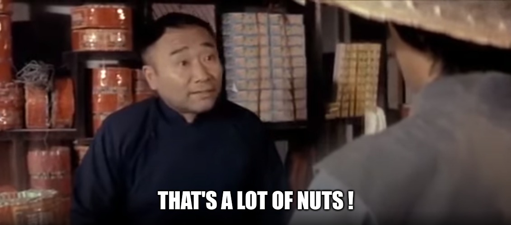

# NSEC20 - Weakhash

## Introduction

To give a little bit of context for this challenge, we were given a web application in which we could change a student's grade if we could provide a valid password.
Basically, we would just send the student's ID, the grade we want to give and obviously, the password.
With that in mind, we could jump in the C code we were given which would validate the password.

## Weakhash function

The important part is the `weakhash()` function which will take the password as an input and which will return an 8 bytes hash.
The output will be compared to two possible hashes and if any of the two equals to the output, our password is valid.
But, now, let's just analyze the function.

```c
void weakhash(uint8_t *dst, const char *src)
{
    DES_key_schedule ks;
    DES_cblock key;
    DES_cblock data;
    size_t u, n;
    
    memcpy(data, "weakhash", 8);
    n = strlen(src);
    for (u = 0; u < n; u += 8) {
        size_t v;
        
        for (v = 0; v < 8; v ++) {
            if (u + v < n) {
                key[v] = ((unsigned char)src[u + v] << 1) + 2;
            } else {
                key[v] = 0;
            }
        }
        
        DES_set_key_unchecked(&key, &ks);
        DES_ecb_encrypt(&data, &data, &ks, 1);
    }
    memcpy(dst, data, 8);
}
```

### Initial state

Like most hashing functions, an initial state is set before any operation is done.
Here, that initial state is set to the string `weakhash`.
That state will be encrypted with DES and the output of the encryption becomes the state for the next encryption cycle.
The final state after every encryption cycle will be the output of the function.
In other words, the final state is the value of our hash.

### Encryption cycle

Since DES uses keys of 8 bytes, the password will be chunked and each chunk will be used as a key.
There are as many encryption cycles as there are chunks.
Also, if the last chunk is not 8 bytes long, null bytes will be used to pad the key.
Another detail that we need to keep in mind is that DES doesn't use the parity bit of each byte.
Therefore, instead of having 64 bits for a single key, we have 56 bits.
That's basically what the following line is used for.

```c
    key[v] = ((unsigned char)src[u + v] << 1) + 2
```

It "removes" the parity bit or in other words, it translates the password to a subset of characters.
I used that in my solution to create a list of the 128 possible bytes that can be used as a key (keep in mind that the keys are not the same as the password).
To make it simpler, I used the list of possible bytes that can actually reach the encryption algorithm instead of doing the math of which bytes can and cannot be used (it's a CTF, I didn't have time for that :P ).

### Function summary

To summarize this section, the password is used to encrypt the string `weakhash` and the result is used as the hash.
Some people argued that it was not a real hash (when we were brainstorming) because it could probably be reversed.
However, the only value that we can decrypt is the string `weakhash` and there's no known effective way to retrieve the used key other than bruteforce.
Even for 2^56 values (in the case that the password is 8 bytes), it's not doable in the timeframe of the CTF.
And here starts our quest !

## Quest to diminish complexity

Right now, we don't have much other than the required knowledge to dive deeper.
We want a password that will result in one of the following two hashes.

```c
static const uint8_t ref_hv1[8] = {
    0xDA, 0x99, 0xD1, 0xEA, 0x64, 0x14, 0x4F, 0x3E
};
static const uint8_t ref_hv2[8] = {
    0x59, 0xA3, 0x44, 0x2D, 0x8B, 0xAB, 0xCF, 0x84
};
```

### Happy birthday paradox

To compute one of these hashes, we have a password that we can split in chunks (the applied keys).
_*Note : For the rest of this writeup, I'll call key1 the first chunk of the password, key2 the second chunk and so on.*_
With that in mind, each key has 2^56 possible values. (Remember that the parity bit isn't used as we discussed earlier !)
With an 8 bytes password, there are 2^56 possible hashes since there are 2^56 keys.
And I couldn't see myself bruteforcing 2^56 possible values during the CTF...
So, I figured that we had two possible hashes and therefore, twice the chances to get a valid hash !
Nice ! We've got a complexity of 2^55 instead of 2^56, but that's still quite a bit...

What about a password of 16 bytes (two keys).
Well, I guess that we have 2^56 * 2^56 = 2^112....
And this will only get bigger by adding more keys...
So, how could we diminish these numbers... :(

Let's rewind just a bit, we could divide by 2 our complexity because we have two possible hashes !
Hmmm... But, we don't have any more possible hashes =/
Is there a way we could generate some ?
And with that in mind, I went into a hot shower to let my brain disconnect for a bit...
On a side note, to have a shower seems to be OP in a nsec where we're used to not have access to such a weapon !
And then... EUREKA !
We could decrypt the possible hashes with a key (key2) to get some intermediate hashes !
Wait ? What do you mean, asked my team ?
Well, you see, if I try many key2, I'll get many intermediate hashes.
These hashes are possible values that we can reach when encrypting the initial state `weakhash` with the key1 we are bruteforcing !
Still not clear ? No problem, to be fair, I wasn't so sure either, but it made sense to me.
What about a little diagram ?


On the first line, we have the hashing when using only one key.
We see why we can divide our complexity by two, since it's clear that we have two possible "destinations" for our encryption.

Below that, we have the hashing when using two keys.
I think with that diagram, it's easier to see that we have way more possible "destinations" when encrypting with key1.
In other words, with that many possible intermediate values, there MUST be a key1 that will give us one of these intermediate values (and it's WAY easier to find one).
This is called the Birthday Paradox.

### Time to meet in the middle

So, what happens if we compute 2^32 intermediate hashes by bruteforcing key2 and that we store the computed key2 in a hashmap where our hashmap key is the hash and our hashmap value is the used key2 ?
Well, that would mean that when bruteforcing key1, we would have 2^32 more chances to get on a valid intermediate hash !
And that is what we call a Meet-in-the-Middle attack ! :)

### Final complexity calculation

When we were calculating the complexity with one key, we said that we decreased it to 2^55 since we had two possible hashes.
However, here, it will be a bit different since we have two keys.
Why, you might ask ?
At first, I was sure we were working with 2^56...
The thing is that even if there are 2^56 possible intermediate hashes because there are 2^56 possible keys, these hashes spread accross a 2^64 range of values.
The other thing to keep in mind is that when encrypting the string `weakhash` with key1, we do not necessarily generate all the same intermediate hashes as when decrypting `ref_hv1` or `ref_hv2` with key2.
To illustrate this, a Venn diagram should do the trick.

```
|--------------------------------------- 2^64 possible hash values --------------------------------------|
|-------------------------- 2^56 possible hashes with key1 --------------------------|
                    |-------------------------- 2^56 possible hashes with key2 --------------------------|
```

With that out of the way, let's calculate our complexity !
We have 2^64 possible values of intermediate hashes.
We'll need to decrypt the valid hashes with 2^32 keys (key2) in order to store in memory 2^32 key2 that are mapped with the resulting intermediate hashes.
With 2^32 intermediate hashes, we have 2^32 more chances to have a hit when bruteforcing key1 and encrypting `weakhash`.
Mathematically, we can represent all that like this `2^64 / 2^32 = 2^(64-32) = 2^32`.

In other words, we basically have to bruteforce only 2^32 key2.
Then, with the birthday paradox, it should take around 2^32 key1 to compute a valid intermediate hash.
So, the final complexity (of the most optimal way to solve this challenge) would be `2^32 + 2^32 = 2 * 2^32 = 2^33`.

## Implementation of the solution

For now, we have basically solved the challenge, we just need to implement it. :)
Obviously, that requires quite a lot of memory to store 2^32 keys of 56 bits.
In a classic array, it would require 28 GB.
However, the addresses must be on 64 bits since the intermediate hashes can spread on 2^64 possible values.
This would require 120259084288 GB to store a total of 28 GB...



### The CTF way !

From here, there are two ways to implement this, the optimal and memory efficient way and the CTF way !
Guess which one we'll use ? _*wink wink* The CTF way_
Before moving on, the optimal way would be to use an array with 2^32 addresses.
These addresses could be computed from the first 32 bits of each computed intermediate hashes, but obviously, the complexity would change since we would have hits that might be invalid (because we use only 32 bits instead of the whole 64 bits).

What is our goal here ?
We want to store as many key2 as we can in a way that we can have an almost O(1) lookup.
And now, what is the most CTF way to solve that ?
You guessed it ! We google for a C implementation of an hashmap and we use it almost blindly ! :D

```c
// Structure used to store the intermediate hashes and keys.
// This will be used to make linked lists in the hash map.

struct nlist { /* table entry: */
    struct nlist *next; /* next entry in chain */
    unsigned char *name; /* defined name */
    unsigned char *defn; /* replacement text */
};

#define HASHSIZE 75000000
#define BLOCKSIZE 8
struct nlist **hashtab;

// Calculate the hash used for the hashmap key
unsigned hash(unsigned char *s)
{
    unsigned hashval = 0;
    int i;
    //for (hashval = 0; *s != '\0'; s++)
    for (i = 0; i < BLOCKSIZE; i++, s++)
      hashval = *s + 31 * hashval;
    return hashval % HASHSIZE;
}

// The function name says it all
struct nlist *lookup(unsigned char *s)
{
    struct nlist *np;
    for (np = hashtab[hash(s)]; np != NULL; np = np->next)
        if (memcmp(s, np->name, BLOCKSIZE) == 0)
          return np; /* found */
    return NULL; /* not found */
}

unsigned char * stringdup(unsigned char *s) /* make a duplicate of s */
{
    unsigned char *p;
    p = (unsigned char *) malloc(BLOCKSIZE+1); /* +1 for ’\0’ */
    if (p != NULL)
       memcpy(p, s, BLOCKSIZE);
    return p;
}

// Function used to add values to the hash map
struct nlist *install(unsigned char *name, unsigned char *defn)
{
    struct nlist *np;
    unsigned hashval;
    if ((np = lookup(name)) == NULL) { /* not found */
        np = (struct nlist *) malloc(sizeof(*np));
        if (np == NULL || (np->name = stringdup(name)) == NULL)
          return NULL;
        hashval = hash(name);
        np->next = hashtab[hashval];
        hashtab[hashval] = np;
    } else /* already there */
        free((void *) np->defn); /*free previous defn */
    if ((np->defn = stringdup(defn)) == NULL)
       return NULL;
    return np;
}
```

### Building blocks

We now have our little store, we just need something to fill it with ! :)
The next step is to decrypt `ref_hv1` and `ref_hv2` to get intermediate hashes.
Since the probabilities don't change, I could have used only one of the two possible hashes.
In my CTF implementation, I decided to have N/2 intermediate hashes of both `ref_hv1` and `ref_hv2` instead of having N intermediate hashes calculated from only one of these.
If it bugs you, just keep in mind that it's the same complexity and that the total memory usage is the same. :)

Now to the implementation ! Since it was a CTF, I created two functions to decrypt with a given key the two given hashes.
These two functions can be used to generate intermediate hashes that can be used as hashmap keys to store our precious key2.

```c
// Decrypts ref_hv1 with the given key and returns the intermediate hash (as the function name implies)
void decryptH1(uint8_t *dst, const char *src)
{
	DES_key_schedule ks;
	DES_cblock key;
	DES_cblock data;
    static const uint8_t ref_hv1[8] = {
		0xDA, 0x99, 0xD1, 0xEA, 0x64, 0x14, 0x4F, 0x3E
	};
	size_t i;

	memcpy(data, ref_hv1, 8);
	for (i = 0; i < BLOCKSIZE; i++) {
		key[i] = src[i];
	}
        
    DES_set_key_unchecked(&key, &ks);
    DES_ecb_encrypt(&data, &data, &ks, 0); // The 0 tells the function to decrypt
	memcpy(dst, data, 8);
}

// Decrypts ref_hv2 with the given key and returns the intermediate hash (as the function name implies)
void decryptH2(uint8_t *dst, const char *src)
{
	DES_key_schedule ks;
	DES_cblock key;
	DES_cblock data;
	static const uint8_t ref_hv2[8] = {
		0x59, 0xA3, 0x44, 0x2D, 0x8B, 0xAB, 0xCF, 0x84
	};
	size_t i;

	memcpy(data, ref_hv2, 8);
	for (i = 0; i < BLOCKSIZE; i++) {
		key[i] = src[i];
	}
        
    DES_set_key_unchecked(&key, &ks);
    DES_ecb_encrypt(&data, &data, &ks, 0); // The 0 tells the function to decrypt
	memcpy(dst, data, 8);
}
```

### We shall meet again

We now only need one last piece to the puzzle and it's to "meet" our intermediate hashes by calculating more intermediate hashes !
How do we do that ? I'll repeat one last time, we encrypt the string `weakhash` with key1.
That's pretty much what the following function does.
The output of this function will be used to lookup in our hashmap.

```c
// I know, the function name is not really explicit...
void encryptDES(uint8_t *dst, const char *src)
{
	DES_key_schedule ks;
	DES_cblock key;
	DES_cblock data;
	size_t i;

	memcpy(data, "weakhash", 8);
	for (i = 0; i < 8; i ++) {
		key[i] = src[i];
	}
    
    DES_set_key_unchecked(&key, &ks);
    DES_ecb_encrypt(&data, &data, &ks, 1); // The 1 tells the function to encrypt
	memcpy(dst, data, 8);
}
```

### No need to be DESperate...

That subtitle... I wanted a DES wordplay...
Anyway, time to put all that together and what a better way to do so than just adding my complete source code !
There are two main loops. The first gathers keys (key2) and store them in the hashmap.
The second loop is called when the gathering phase is over.
It is used to lookup in the hashmap and this is where our password will be generated !

```c
#include <stdio.h>
#include <stdlib.h>
#include <string.h>
#include <stdint.h>
#include <stdarg.h>
#include <errno.h>
#include <math.h>

#include <unistd.h>

#include <openssl/des.h>

struct nlist { /* table entry: */
    struct nlist *next; /* next entry in chain */
    unsigned char *name; /* defined name */
    unsigned char *defn; /* replacement text */
};

//#define HASHSIZE 134217728
#define HASHSIZE 75000000
#define BLOCKSIZE 8
struct nlist **hashtab;


/* hash: form hash value for string s */
unsigned hash(unsigned char *s)
{
    unsigned hashval = 0;
    int i;
    //for (hashval = 0; *s != '\0'; s++)
    for (i = 0; i < BLOCKSIZE; i++, s++)
      hashval = *s + 31 * hashval;
    return hashval % HASHSIZE;
}

/* lookup: look for s in hashtab */
struct nlist *lookup(unsigned char *s)
{
    struct nlist *np;
    for (np = hashtab[hash(s)]; np != NULL; np = np->next)
        if (memcmp(s, np->name, BLOCKSIZE) == 0)
          return np; /* found */
    return NULL; /* not found */
}

unsigned char * stringdup(unsigned char *s) /* make a duplicate of s */
{
    unsigned char *p;
    p = (unsigned char *) malloc(BLOCKSIZE+1); /* +1 for ’\0’ */
    if (p != NULL)
       memcpy(p, s, BLOCKSIZE);
    return p;
}
/* install: put (name, defn) in hashtab */
struct nlist *install(unsigned char *name, unsigned char *defn)
{
    struct nlist *np;
    unsigned hashval;
    if ((np = lookup(name)) == NULL) { /* not found */
        np = (struct nlist *) malloc(sizeof(*np));
        if (np == NULL || (np->name = stringdup(name)) == NULL)
          return NULL;
        hashval = hash(name);
        np->next = hashtab[hashval];
        hashtab[hashval] = np;
    } else /* already there */
        free((void *) np->defn); /*free previous defn */
    if ((np->defn = stringdup(defn)) == NULL)
       return NULL;
    return np;
}

void printHex(unsigned char* buf, size_t len) {
    for(int i = 0; i < len; i++)
    {
        printf("0x%02hhX, ", buf[i]);
    }

    puts("");
}

// I know, the function name is not really explicit...
void encryptDES(uint8_t *dst, const char *src)
{
	DES_key_schedule ks;
	DES_cblock key;
	DES_cblock data;
	size_t i;

	memcpy(data, "weakhash", 8);
	for (i = 0; i < 8; i ++) {
		key[i] = src[i];
	}
    
    DES_set_key_unchecked(&key, &ks);
    DES_ecb_encrypt(&data, &data, &ks, 1); // The 1 tells the function to encrypt
	memcpy(dst, data, 8);
}

// Decrypts ref_hv1 with the given key and returns the intermediate hash (as the function name implies)
void decryptH1(uint8_t *dst, const char *src)
{
	DES_key_schedule ks;
	DES_cblock key;
	DES_cblock data;
    static const uint8_t ref_hv1[8] = {
		0xDA, 0x99, 0xD1, 0xEA, 0x64, 0x14, 0x4F, 0x3E
	};
	size_t i;

	memcpy(data, ref_hv1, 8);
	for (i = 0; i < BLOCKSIZE; i++) {
		key[i] = src[i];
	}
        
    DES_set_key_unchecked(&key, &ks);
    DES_ecb_encrypt(&data, &data, &ks, 0); // The 0 tells the function to decrypt
	memcpy(dst, data, 8);
}

// Decrypts ref_hv2 with the given key and returns the intermediate hash (as the function name implies)
void decryptH2(uint8_t *dst, const char *src)
{
	DES_key_schedule ks;
	DES_cblock key;
	DES_cblock data;
	static const uint8_t ref_hv2[8] = {
		0x59, 0xA3, 0x44, 0x2D, 0x8B, 0xAB, 0xCF, 0x84
	};
	size_t i;

	memcpy(data, ref_hv2, 8);
	for (i = 0; i < BLOCKSIZE; i++) {
		key[i] = src[i];
	}
        
    DES_set_key_unchecked(&key, &ks);
    DES_ecb_encrypt(&data, &data, &ks, 0); // The 0 tells the function to decrypt
	memcpy(dst, data, 8);
}

void printCharToKeyMapping() {
    int i;
	for (i = 1; i < 256; i++) {
		printf("'\\x%02x':'\\x%02x',\n", i, (((unsigned char)i << 1) + 2) & 0xff);
	}
}

void bruteforce() {
    // The 128 possible bytes
    unsigned char legal_chars[] = {0x00, 0x02, 0x04, 0x06, 0x08, 0x0a, 0x0c, 0x0e, 0x10, 0x12, 0x14, 0x16, 0x18, 0x1a, 0x1c, 0x1e, 0x20, 0x22, 0x24, 0x26, 0x28, 0x2a, 0x2c, 0x2e, 0x30, 0x32, 0x34, 0x36, 0x38, 0x3a, 0x3c, 0x3e, 0x40, 0x42, 0x44, 0x46, 0x48, 0x4a, 0x4c, 0x4e, 0x50, 0x52, 0x54, 0x56, 0x58, 0x5a, 0x5c, 0x5e, 0x60, 0x62, 0x64, 0x66, 0x68, 0x6a, 0x6c, 0x6e, 0x70, 0x72, 0x74, 0x76, 0x78, 0x7a, 0x7c, 0x7e, 0x80, 0x82, 0x84, 0x86, 0x88, 0x8a, 0x8c, 0x8e, 0x90, 0x92, 0x94, 0x96, 0x98, 0x9a, 0x9c, 0x9e, 0xa0, 0xa2, 0xa4, 0xa6, 0xa8, 0xaa, 0xac, 0xae, 0xb0, 0xb2, 0xb4, 0xb6, 0xb8, 0xba, 0xbc, 0xbe, 0xc0, 0xc2, 0xc4, 0xc6, 0xc8, 0xca, 0xcc, 0xce, 0xd0, 0xd2, 0xd4, 0xd6, 0xd8, 0xda, 0xdc, 0xde, 0xe0, 0xe2, 0xe4, 0xe6, 0xe8, 0xea, 0xec, 0xee, 0xf0, 0xf2, 0xf4, 0xf6, 0xf8, 0xfa, 0xfc, 0xfe};
	unsigned char key[8];
    uint8_t hh[8];
    int a, b, c, d, e, f, g, h, i;
    struct nlist * entry;

    printf("Starting to try keys !!!\n------------------------------------------------------------------------------------------\n");

    unsigned long long count = 0;
    for (a = 0; a < 128; a++){
    for (b = 0; b < 128; b++){
    for (c = 0; c < 128; c++){
    for (d = 0; d < 128; d++){
    for (e = 0; e < 128; e++){
    for (f = 0; f < 128; f++){
    for (g = 0; g < 128; g++){
    for (h = 0; h < 128; h++){
        // Generating the key
        key[0] = legal_chars[a];
        key[1] = legal_chars[b];
        key[2] = legal_chars[c];
        key[3] = legal_chars[d];
        key[4] = legal_chars[e];
        key[5] = legal_chars[f];
        key[6] = legal_chars[g];
        key[7] = legal_chars[h];
        
        // Encrypting "weakhash" with the bruteforced key
        encryptDES(hh, key);

        // Looking up for a key with the calculated intermediate hash
        entry = lookup(hh);
        if(entry != NULL) {
            printf("FOUND !!!!!!!!!!!\nTHE KEY IS : ");
            for(int i = 0; i < BLOCKSIZE; i++)
            {
                printf("\\x%02hhX, ", key[i]);
            }
            for(int i = 0; i < BLOCKSIZE; i++)
            {
                printf("\\x%02hhX, ", entry->defn[i]);
            }
            printf("\n");
            exit(0);
        }
        count++;
        if(count % 5000000 == 0) {
            printf("Count = %llu\n", count);
            printHex(key, 8);
        }
    }}}}}}}}
}

int main(int argc, char * argv[])
{
    hashtab = malloc(HASHSIZE * 8);
    printCharToKeyMapping();
    
    int start = 0, end = 128;
    if (argc > 3) {
        start = atoi(argv[1]);
        end = atoi(argv[2]);
    }    

    // The 128 possible bytes
    unsigned char legal_chars[] = {0x00, 0x02, 0x04, 0x06, 0x08, 0x0a, 0x0c, 0x0e, 0x10, 0x12, 0x14, 0x16, 0x18, 0x1a, 0x1c, 0x1e, 0x20, 0x22, 0x24, 0x26, 0x28, 0x2a, 0x2c, 0x2e, 0x30, 0x32, 0x34, 0x36, 0x38, 0x3a, 0x3c, 0x3e, 0x40, 0x42, 0x44, 0x46, 0x48, 0x4a, 0x4c, 0x4e, 0x50, 0x52, 0x54, 0x56, 0x58, 0x5a, 0x5c, 0x5e, 0x60, 0x62, 0x64, 0x66, 0x68, 0x6a, 0x6c, 0x6e, 0x70, 0x72, 0x74, 0x76, 0x78, 0x7a, 0x7c, 0x7e, 0x80, 0x82, 0x84, 0x86, 0x88, 0x8a, 0x8c, 0x8e, 0x90, 0x92, 0x94, 0x96, 0x98, 0x9a, 0x9c, 0x9e, 0xa0, 0xa2, 0xa4, 0xa6, 0xa8, 0xaa, 0xac, 0xae, 0xb0, 0xb2, 0xb4, 0xb6, 0xb8, 0xba, 0xbc, 0xbe, 0xc0, 0xc2, 0xc4, 0xc6, 0xc8, 0xca, 0xcc, 0xce, 0xd0, 0xd2, 0xd4, 0xd6, 0xd8, 0xda, 0xdc, 0xde, 0xe0, 0xe2, 0xe4, 0xe6, 0xe8, 0xea, 0xec, 0xee, 0xf0, 0xf2, 0xf4, 0xf6, 0xf8, 0xfa, 0xfc, 0xfe};
	unsigned char key[8];
    uint8_t primeh1[8], primeh2[8];
    int a, b, c, d, e, f, g, h, i;
    
    struct nlist * entry;

    printf("Starting to hoard keys !!!\n------------------------------------------------------------------------------------------\n");

    unsigned long long count = 0;
    for (a = start; a < end; a++){
    for (b = 0; b < 128; b++){
    for (c = 0; c < 128; c++){
    for (d = 0; d < 128; d++){
    for (e = 0; e < 128; e++){
    for (f = 0; f < 128; f++){
    for (g = 0; g < 128; g++){
    for (h = 0; h < 128; h++){
        // Generating the key
        key[0] = legal_chars[a];
        key[1] = legal_chars[b];
        key[2] = legal_chars[c];
        key[3] = legal_chars[d];
        key[4] = legal_chars[e];
        key[5] = legal_chars[f];
        key[6] = legal_chars[g];
        key[7] = legal_chars[h];
         
        // Calculating the intermediate hashes
        decryptH1(primeh1, key);
        decryptH2(primeh2, key);
        
        // Pushing the intermediate hashes into the hashmap
        install(primeh1, key);
        install(primeh2, key);
        
        count++;
        if(count % 5000000 == 0) {
            printf("Count = %llu\n", count);
            printHex(key, 8);
        }
        if(count >= HASHSIZE) {
            bruteforce();
            exit(0);
        }
    }}}}}}}}
	return 0;
}
```

## Conclusion

You might have seen in the implementation that I'm only using the 128 possible bytes after the password conversion in the `weakhash()` function.
A little conversion is required before submitting the password.
That's why I printed the mapping of all 256 ascii characters to the 128 possible bytes.
With that mapping, it's quite easy to go back to a valid password !

Anyway, that's all for this writeup.
I want to say a huge thank to Thomas Pornin for making me learn this much and I hope you've learned as much as well ! :)

-- Sideni

